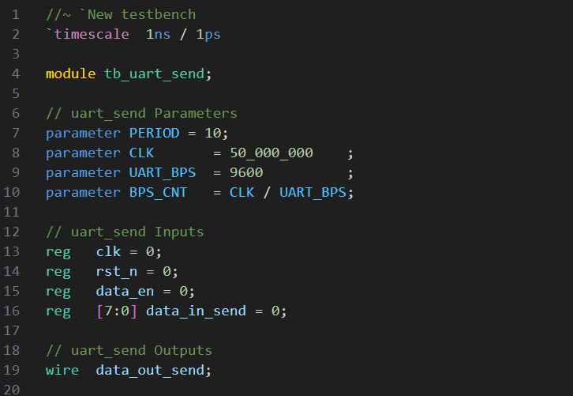
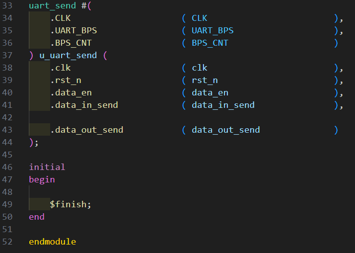
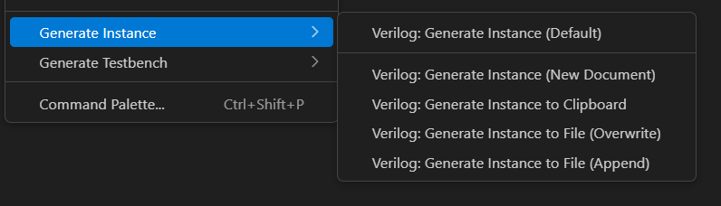
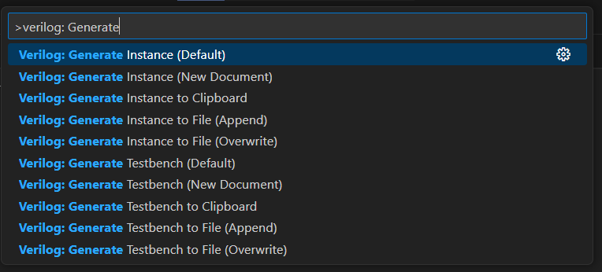
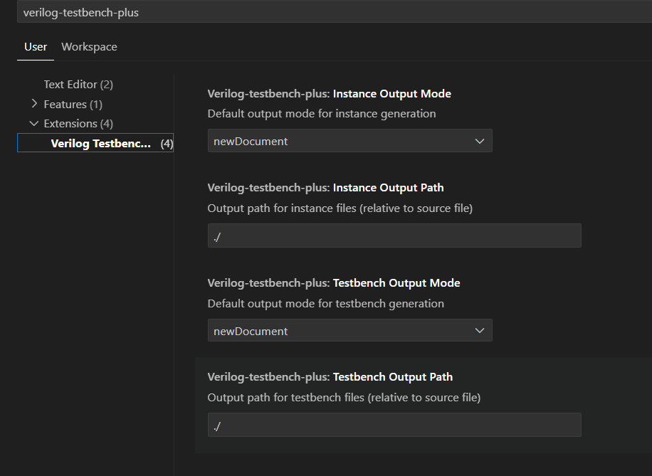
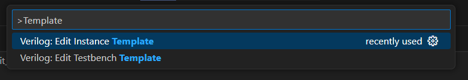
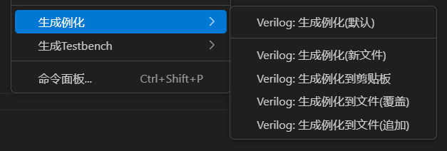
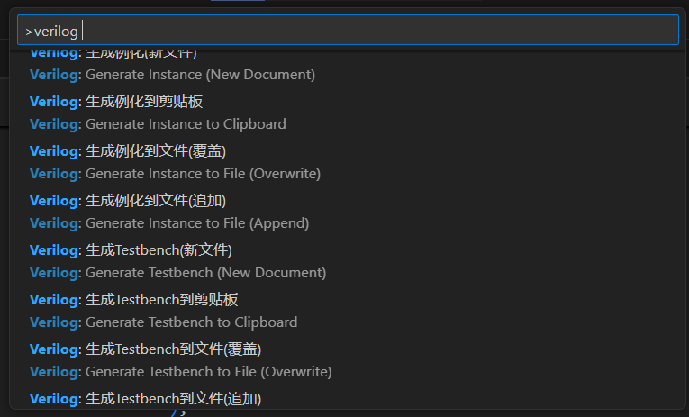
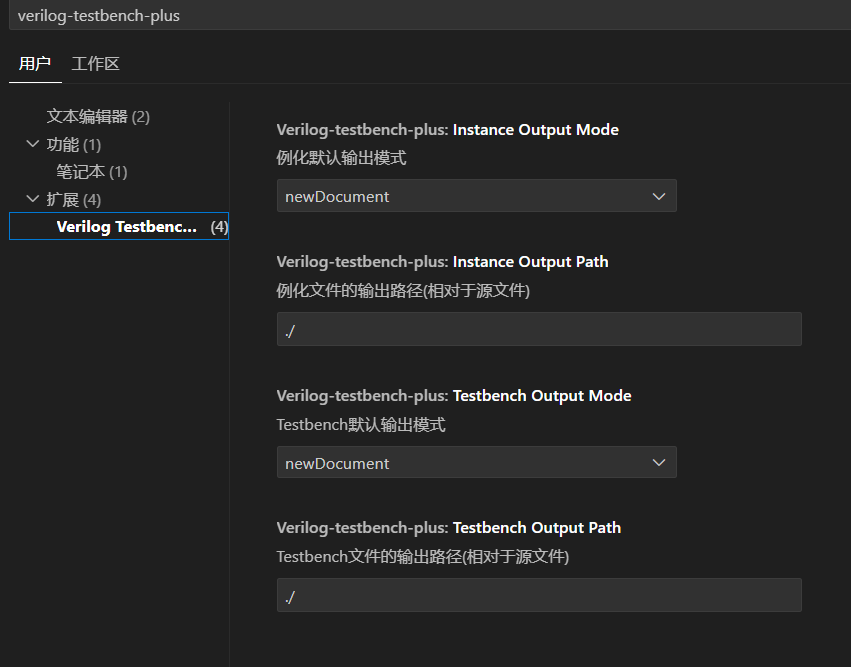
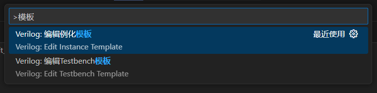

# Verilog Testbench Plus README

### 中文版在后面

This extension was developed with reference to:  
[Verilog_Testbench](https://marketplace.visualstudio.com/items?itemName=Truecrab.verilog-testbench-instance)

## Features

* Automatically generates Testbench
* Automatically generates module instantiation
* Multiple output options
    * Create new document  
    * Copy to clipboard  
    * Overwrite existing file  
    * Append to existing file
* Customizable configurations
    * Custom generation templates
    * Set default output path
    * Configure default behavior for output




## Usage
* Right-click in the editor



* Command Palette (Ctrl + Shift + P)



## Extension Settings

* Settings



* Custom template file (Ctrl + Shift + P)



* Default configurations

* Instantiation Template:

```
// ${MODULE_NAME} Parameters
${PARAMETER_DECLARATION}

// ${MODULE_NAME} Inputs
${INPUT_DECLARATION}

// ${MODULE_NAME} Outputs
${OUTPUT_DECLARATION}

// ${MODULE_NAME} Bidirs
${INOUT_DECLARATION}

${MODULE_NAME} ${PARAMETER_DEFINITION} u_${MODULE_NAME} (
${PORT_CONNECTION}
);
```

* Testbench Template:

```
//~ `New testbench
`timescale  1ns / 1ps

module tb_${MODULE_NAME};

// ${MODULE_NAME} Parameters
parameter PERIOD = 10;
${PARAMETER_DECLARATION}

// ${MODULE_NAME} Inputs
${INPUT_DECLARATION}

// ${MODULE_NAME} Outputs
${OUTPUT_DECLARATION}

// ${MODULE_NAME} Bidirs
${INOUT_DECLARATION}

initial
begin
    forever #(PERIOD/2)  clk=~clk;
end

initial
begin
    #(PERIOD*2) rst_n  =  1;
end

${MODULE_NAME} ${PARAMETER_DEFINITION} u_${MODULE_NAME} (
${PORT_CONNECTION}
);

initial
begin

    $finish;
end

endmodule
```

## Version History

### 0.0.1

Initial release

## Repository

* [https://github.com/WaterBlock623/verilog-testbench-tofile](https://github.com/WaterBlock623/verilog-testbench-tofile)

### **Enjoy!**

# Verilog Testbench Plus README

本扩展编写时参考：
[Verilog_Testbench](https://marketplace.visualstudio.com/items?itemName=Truecrab.verilog-testbench-instance)

## 功能

* 自动生成Testbench

* 自动生成模块例化

* 多种输出选项

    * 创建新文档  
    * 复制到剪贴板  
    * 覆盖现有文件  
    * 追加到现有文件

* 自定义配置

    * 自定义生成模板
    * 设置默认输出路径
    * 设置输出的默认行为


## 使用方式
* 编辑器内右键



* 命令面板(Ctrl + Shift + P)



## 扩展设置

* 设置



* 自定义模板文件(Ctrl + Shift + P)



* 默认配置

* 例化

```
// ${MODULE_NAME} Parameters
${PARAMETER_DECLARATION}

// ${MODULE_NAME} Inputs
${INPUT_DECLARATION}

// ${MODULE_NAME} Outputs
${OUTPUT_DECLARATION}

// ${MODULE_NAME} Bidirs
${INOUT_DECLARATION}

${MODULE_NAME} ${PARAMETER_DEFINITION} u_${MODULE_NAME} (
${PORT_CONNECTION}
);
```

* Testbench

```
//~ `New testbench
`timescale  1ns / 1ps

module tb_${MODULE_NAME};

// ${MODULE_NAME} Parameters
parameter PERIOD = 10;
${PARAMETER_DECLARATION}

// ${MODULE_NAME} Inputs
${INPUT_DECLARATION}

// ${MODULE_NAME} Outputs
${OUTPUT_DECLARATION}

// ${MODULE_NAME} Bidirs
${INOUT_DECLARATION}

initial
begin
    forever #(PERIOD/2)  clk=~clk;
end

initial
begin
    #(PERIOD*2) rst_n  =  1;
end

${MODULE_NAME} ${PARAMETER_DEFINITION} u_${MODULE_NAME} (
${PORT_CONNECTION}
);

initial
begin

    $finish;
end

endmodule
```

## 版本说明

### 0.0.1

首次发布

## 存储库

* [https://github.com/WaterBlock623/verilog-testbench-tofile](https://github.com/WaterBlock623/verilog-testbench-tofile)

### **Enjoy!**